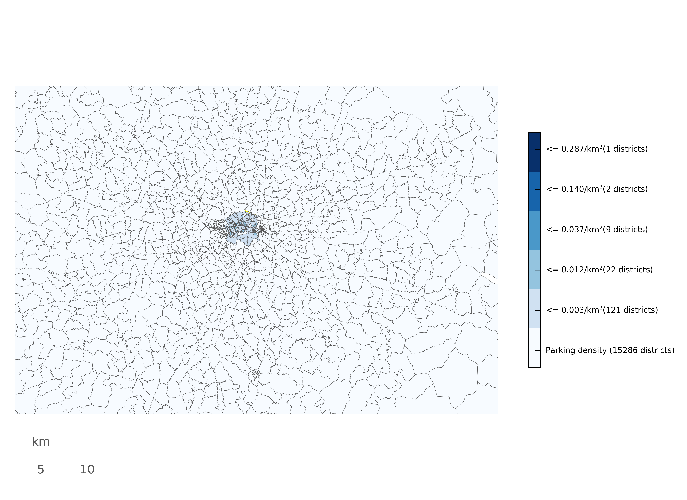

A little suite of scripts used for finding out handy things about London. And parking.

### Getting postcodes of interest
Specify a radius (r) and an initial postcode and the script will head off and grab all of the postcodes in an r km radius of the postcode you've specified. This is all written to a file called `postcodes_of_interest.csv`. 

### Getting valuation data from postcodes
Given the file `postcodes_of_interest.csv` this script will go to the Government valuations website and run searches against each of the 'areas' (postcode minus the last number and letter). This currently only looks at categories 'CP' and 'CP1' i.e. car parking. This information is all downloaded, formatted and put into `valuationData.csv`.

### Getting planning applications data from postcodes
The script `get_planning_data.py` can be used with a list of postcodes to automatically grab all the planning application data (from Islington council website) from those postcodes. However, it's pretty slow and generates quite a few requests (>2000) so I think you're best using...

### Getting planning applications from ward name
The script `get_all_planning_data.py` gets all of the planning application information held on the Islington council website. Rather than going through postcode by postcode it selects each ward in turn and then iterates over all of the pages returned for a more expensive initial query but many fewer queries. Seems to be much quicker and is less likely to take the council website down.

### Plotting some of the data
The script `my_plotter.py` basically shows how complicated it is to produce a reasonable(ish) postcode graph in Python. Honestly, it's a nightmare. But any way, I've not included all of the data required to be able to do the plotting but here's how to get it:
1. Clone this repo
2. Run this command: `wget http://www.opendoorlogistics.com/wp-content/uploads/Data/UK-postcode-boundaries-Jan-2015.zip`
3. Run this command: `unzip UK-postcode-boundaries-Jan-2015.zip -d uk_postcodes`
4. Run this command: `wget http://sensitivecities.com/extra/london.zip`
5. Run this command: `unzip london.zip -d data`

Then you're going to have to install all the dependencies. No telling how hard that's going to be. But then you can run the script and get something like this:

So that's just something simple - namely, the parking area density per postcode area, within N kilometers of Angel station.

### Joining the valuations data and planning applications data
To be done when the planning applications data has downloaded...
